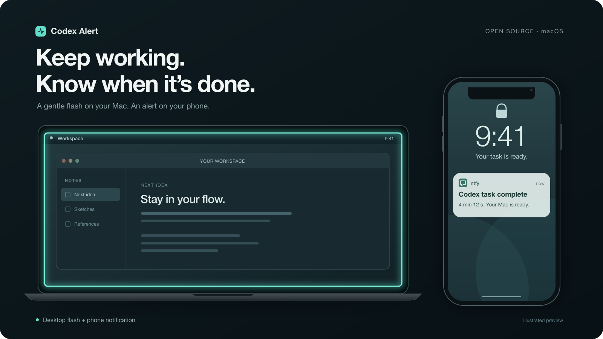

# Codex Alert

**Laisse Codex travailler. Sois prévenu quand il a fini.** Un petit outil open source pour macOS, avec une skill Codex optionnelle.

[English](README.md) · [Télécharger le ZIP](https://github.com/HKASAR1239/codex-alert/archive/refs/heads/main.zip) · [Licence MIT](LICENSE)


*Aperçu illustré, pas une capture réelle. L'apparence de la notification dépend du téléphone.*

## Fonctionnalités

- **Mac :** le contour de l'écran clignote doucement en turquoise trois fois, pendant environ quatre secondes, sans interrompre la saisie.
- **Téléphone :** une notification via [ntfy](https://ntfy.sh/), avec la durée de la tâche. Aucun numéro de téléphone ni compte nécessaire.
- Se déclenche lorsqu'un tour Codex local de **plus de 2 minutes** se termine, même depuis une autre application. Ignore les tours interrompus et les sous-agents.
- Fonctionne en arrière-plan et démarre à l'ouverture de session. Seuil de durée et effet visuel réglables.

## Installation

Il faut **macOS 13+, Python 3.9+ et les Xcode Command Line Tools**. Si ces outils manquent, lance d'abord `xcode-select --install` dans Terminal. Aucun paquet Python à installer.

1. [Télécharge le ZIP](https://github.com/HKASAR1239/codex-alert/archive/refs/heads/main.zip) et décompresse-le.
2. Double-clique sur **`install.command`**. Tu peux aussi ouvrir Terminal dans ce dossier et lancer `bash install.command`.
3. Installe ntfy sur [iPhone](https://apps.apple.com/app/ntfy/id1625396347) ou [Android](https://docs.ntfy.sh/subscribe/phone/) et autorise les notifications.
4. Dans ntfy, abonne-toi au sujet aléatoire affiché par l'installateur, sur le serveur **`https://ntfy.sh`**. Appuie sur Entrée sur le Mac pour envoyer le test.

Garde le sujet privé : toute personne qui le connaît peut lire et envoyer des alertes. Il s'affiche seulement dans ton terminal local. [Détails de confidentialité](PRIVACY.md).

## Commandes utiles

À lancer depuis le dossier téléchargé :

```bash
bash install.command status             # Vérifier le service
bash install.command test-flash         # Voir l'effet sur le Mac
bash install.command test-phone         # Envoyer un test sur le téléphone
bash install.command configure-phone    # Configurer ou reconnecter ntfy
bash install.command phone-off          # Désactiver les alertes téléphone
bash install.command --local-only       # Installer les alertes Mac seules
bash install.command --no-flash          # Installer les alertes téléphone seules
bash install.command --min-seconds 300   # Passer le seuil à 5 minutes
bash install.command uninstall          # Arrêter les alertes et leur démarrage
```

La désinstallation conserve les réglages locaux. `bash install.command --check` vérifie les prérequis sans installer. La [skill Codex fournie](skills/codex-alert/SKILL.md) guide la configuration et les vérifications ; l'ajouter seule ne démarre pas le service.

## À savoir

Le Mac doit rester éveillé et connecté pour recevoir rapidement les alertes téléphone. Les réglages du téléphone ou une indisponibilité de ntfy peuvent les retarder. macOS uniquement ; sessions locales dans `~/.codex/sessions` (ou `CODEX_HOME/sessions`), pas les tâches cloud. La détection dépend du format des événements locaux de Codex, qui peut évoluer. Un tour terminé signifie que Codex a fini de répondre, pas que tous ses contrôles ont réussi.

Seuls un message générique et la durée quittent le Mac : aucun prompt, code, chemin ou titre de tâche n'est envoyé. Projet communautaire indépendant d'OpenAI. [Contributions bienvenues](CONTRIBUTING.md).
